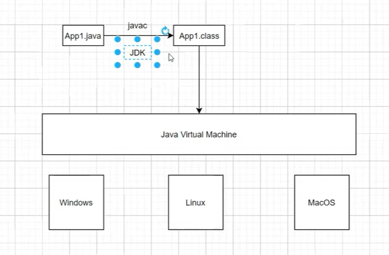
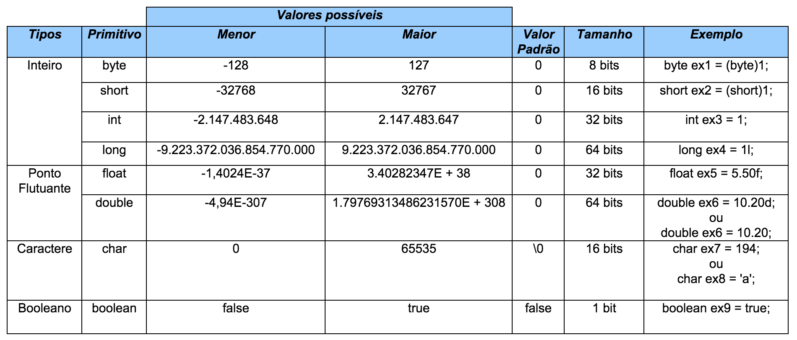
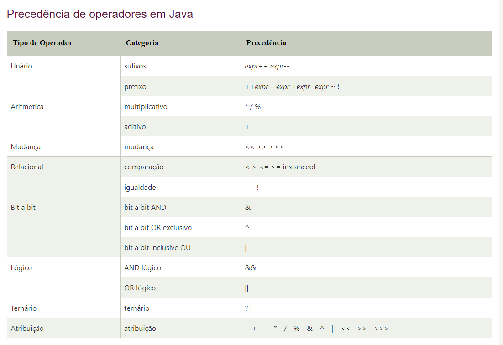
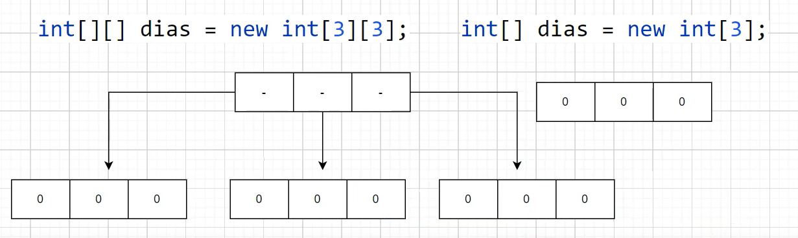
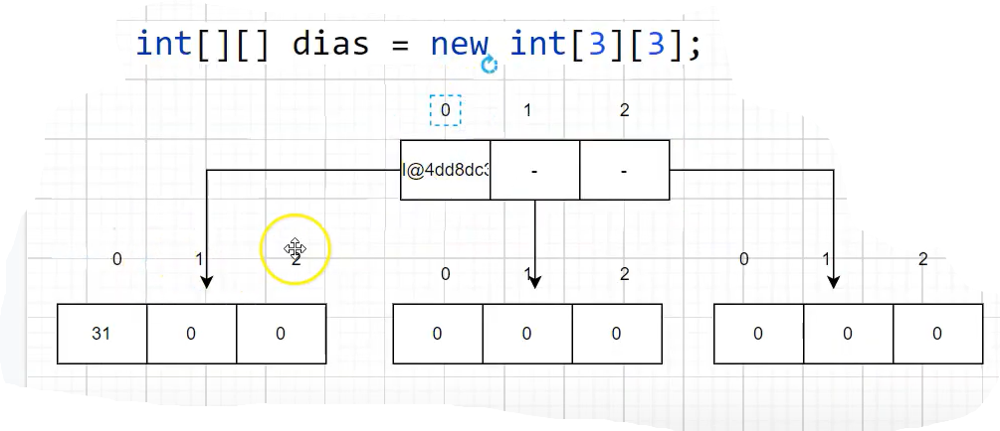

# Dev Dojo Maratona Java

## Como Java Funciona

Cada JVM é especifica para cada SO.
JDK -> possui uma JVM, um compilador, ferramentas de debug. - (Desenvolver)
JRE -> apenas para executar 

arquivo fonte .java que nós vamos compilar e transformar num arquivo .class esse .class nós chamamos de byteCode que
será executado pela JVM.
A JVM vai interpretar e se preocupar em trabalhar com os SO.

## Pacotes

Pacotes eles ajudam a organizar e agrupar as classes que tem coisas em comum. 

A estrutura de pacotes nada mais é que uma estrutura de diretórios. 

- A convenção para criar pacotes começa com:

o dominio do seu site -> seguido do nome do projeto -> e o que você quer ter no seu pacote

## Comentários 

Comentários são pedaços de textos que não influenciam no código

- Comentários Multiplas linhas /**/
- inline //
- Comentários java doc /*
                       *
                        /*
Evitar incluir comentários - péssima prática
Métodos publicas são interesantes tem javadoc

## Tipos primitivos pt 01 - convenções de variáveis

Temos 8 tipos primitivos

- O que são tipos primitivos? são tipos que vão guardar em memória um valor simples
- todos escritos em letras minusculas
- padrão camelCase
- todos os tipos primitivos são numéricos com exceção do boolean, pois o char eu também posso usar numerico.
- A diferença entre eles é a quantidade de valor que você pode colocar dentro do espaço em memória
- byte por exemplo  tem 1 byte e significa 8 bits. 

## casting 

O casting é uma transformação aplicada em valores numéricos para modificar seu tipo de dado.
Casting é quando você força o java a colocar o valor de uma variavel dentro da outra.
Casting não é uma boa prática é mais indicado mudar o tipo

        int age2=(int)10000000000L;
        System.out.println(age2); //após forçar não coube então ele corta os bits, pois ele força a entrada de valores
        //1410065408

## String

String é um tipo de referencia (reference type) e não um tipo primitivo.
String é uma Classe.

## Operadores Relacionais

Operador em java é um símbolo que é usado para executar operações. Por exemplo: +, -, *, / etc.

Existem muitos tipos de operadores em Java que são fornecidos abaixo:

        Operador aritmético,
        Operador Unário,
        Operador shift,
        Operador relacional,
        Operador bit a bit (bitwise),
        Operador lógico,
        Operador ternário e
        Operador de atribuição.

## Estruturas condicionais em Java

As estruturas condicionais possibilitam ao programa tomar decisões e alterar o seu fluxo de execução. 
Isso possibilita ao desenvolvedor o poder de controlar quais são as tarefas e trechos de código executados de acordo com 
diferentes situações, como os valores de variáveis.

As estruturas condicionais geralmente analisam expressões booleanas e, caso estas expressões sejam verdadeiras, 
um trecho do código é executado. No caso contrário, outro trecho do código é executado.

- If/else
O if/else é uma estrutura de condição em que uma expressão booleana é analisada. Quando a condição que estiver 
dentro do if for verdadeira, ela é executada. Já o else é utilizado para definir o que é executado quando a condição
analisada pelo if for falsa. Caso o if seja verdadeiro e, consequentemente executado, o else não é executado.

- Switch/case
A estrutura condicional switch/case vem como alternativa em momentos em que temos que utilizar múltiplos ifs no código. 
Múltiplos if/else encadeados tendem a tornar o código muito extenso, pouco legível e com baixo índice de manutenção.
O switch/case testa o valor contido em uma variável, realizando uma comparação com cada uma das opções. Cada uma dessas 
possíveis opções é delimitada pela instrução case.

## JAVA – Estruturas de Repetição

As estruturas de repetição também são conhecidas como laços (loops) e são utilizados para executar, repetidamente, uma 
instrução ou bloco de instrução enquanto determinada condição estiver sendo satisfeita.

Qualquer que seja a estrutura de repetição, ela contém quatro elementos fundamentais: inicialização, condição, corpo e 
iteração. 

- A inicialização compõe-se de todo código que determina a condição inicial da repetição. 
- A condição é uma expressão booleana avaliada após cada leitura do corpo e determina se uma nova leitura deve ser feita ou se a estrutura de repetição 
deve ser encerrada. 
- O corpo compõe-se de todas as instruções que são executadas repetidamente. 
- A iteração é a instrução que deve ser executada depois do corpo e antes de uma nova repetição.

## While

O termo while pode ser traduzido para o português como “enquanto”. Este termo é utilizado para construir uma estrutura 
de repetição que executa, repetidamente, uma única instrução ou um bloco delas “enquanto” uma expressão booleana for verdadeira.

Veja que a inicialização precede o início da repetição. Isso significa que você deve definir o estado inicial dos elementos 
que serão utilizados nesse laço antes de seu cabeçalho. A palavra reservada while sempre será seguida de um par de parênteses, 
que delimitam a condição desta estrutura de repetição. Essa condição deve ser uma expressão booleana e, enquanto ela for 
verdadeira, esta estrutura continuará executando as instruções contidas no seu corpo.

## Do while

A estrutura de repetição do-while é uma variação da estrutura while. Existe uma diferença sutil, porém importante, entre elas. 
Em um laço while, a condição é testada antes da primeira execução das instruções que compõem seu corpo. Desse modo, se a condição 
for falsa na primeira vez em que for avaliada, as instrução desse laço não serão executadas nenhuma vez. 
Em um laço do-while, por outro lado, a condição somente é avaliada depois que suas instruções são executadas pela primeira vez, 
assim, mesmo que a condição desse laço seja falsa antes de ele iniciar, suas instruções serão executadas pelo menos uma vez.

## Estrutura For

O laço for é uma estrutura de repetição compacta. Seus elementos de inicialização, condição e iteração são reunidos na 
forma de um cabeçalho e o corpo é disposto em seguida.

Veja a sintaxe geral de uma estrutura for:

Observe que a inicialização, condição e iteração aparecem, entre parênteses, após a palavra reservada “for” e elas são 
separadas apenas por um ponto-e-vírgula. A instrução ou bloco de instruções que este tipo de laço repete são transcritos a 
partir da linha subsequente ao seu cabeçalho.

O laço for e o laço while são apenas formas diferentes de uma mesma estrutura básica de repetição. Qualquer laço for 
pode ser transcrito em termos de um laço while e vice-versa. Do mesmo modo que em um laço while, se a condição de um 
laço for já é falsa logo na primeira avaliação que se fizer dela, as instruções contidas em seu corpo jamais serão executadas.

## Arrays

Um array é uma estrutura de dados usada para armazenar dados do mesmo tipo, ou seja reprsenta uma coleção. Os arrays armazenam seus elementos em 
localizações sequenciais contínuas da memória. Em Java, arrays são objetos. Todos os métodos da classe Object podem ser 
invocados em um array.
Permanecem com o mesmo tamanho depois de criados.

– É um objeto, daí ser considerado tipo por referência.

Características Array:

- Todo array é uma variavel do tipo Reference
- Quando declarado em escopo local deve ser inicializado antes de seu uso
- Quando declarado fora de um método será inicializado como null;

## VARIÁVEL DE REFERÊNCIA EM JAVA

Todas as variáveis no Java são “de referência” (exceto se elas forem de tipos primitivos, como “int”, “float”, “short”, 
“double”, “boolean”).

Elas ou apontam para algum objeto, ou então estão vazias (valor “null”).

## Arrays Multidimensionais

Arrays Multidimensionais são estruturas de dados que possuem duas ou mais dimensões. Em suma, temos que um Array que contém 
uma única dimensão funciona internamente como um Array multidimensional. A diferença está na quantidade de índices que cada 
elemento da nossa estrutura terá como identificador.

## OBSERVAÇÕES

- Variaveis locais precisam ser inicializadas senão o código vai falhar no momento da compilação
- 

## Orientação a Objetos

Orientação a objetos é um paradigma aplicado na programação que consiste na interação entre diversas unidades chamadas de objetos.

OO foi criada para mapear o mundo real , para o mundo computacional.

Conseguimos mapear utilizando objetos, que são compostos por atributos e métodos definidos a partir de classes, 
que por sua vez são organizadas em pacotes. Esses conceitos são tão centrais em Java que não se pode programar na 
linguagem sem utilizá-los.

Classe é o que nós temos em java para representar algo do mundo real com funcionalidades em comum. 
Classe é um agrupamentos de coisas do mundo real que vão dar origem a Objetos.

model, domnio ou domain são classes que representam a lógica de negócio.

Estudante estudante; variavel de referencia chamada estudante

Estudante estudante= new Estudante(); criar objetos precisa usar a palavra new e o nome do objeto Estudante();

## Coesão

Coesão é algo que está relacionado ao propósito das suas classes. 
Quando se fala que uma classe é altammente coesa é que ela não está misturando o propósito delas existirem.
A coesão é o grau com o qual um módulo tem uma responsabilidade única e bem definida.

## Métodos (Comportamento das classes)

