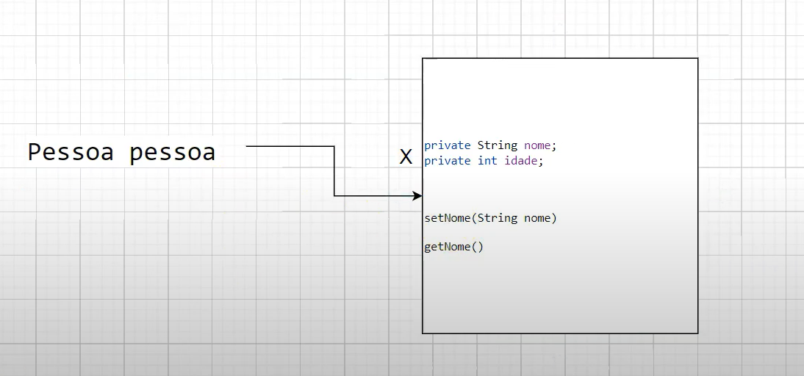
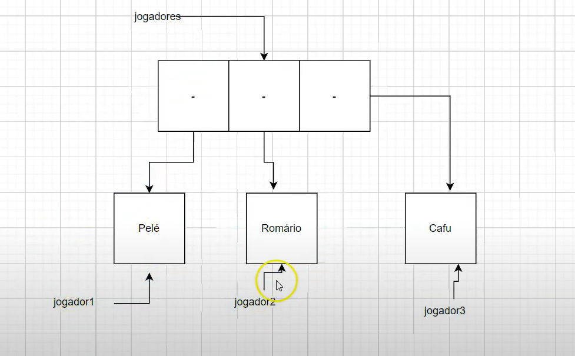
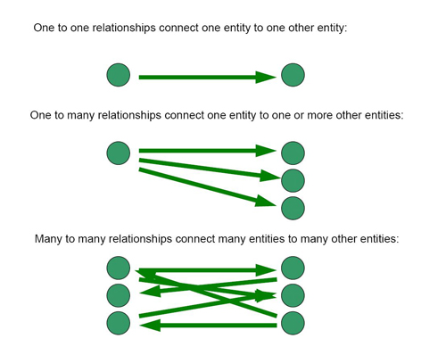
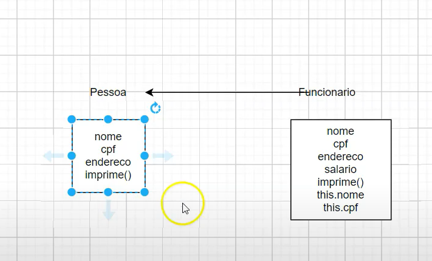
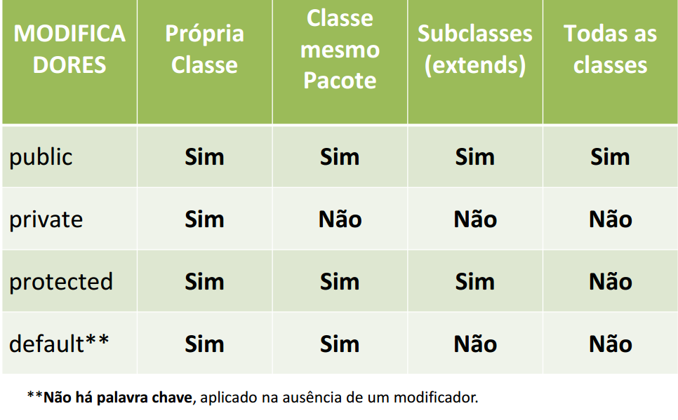
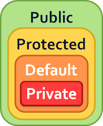
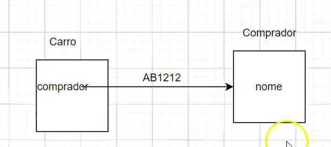
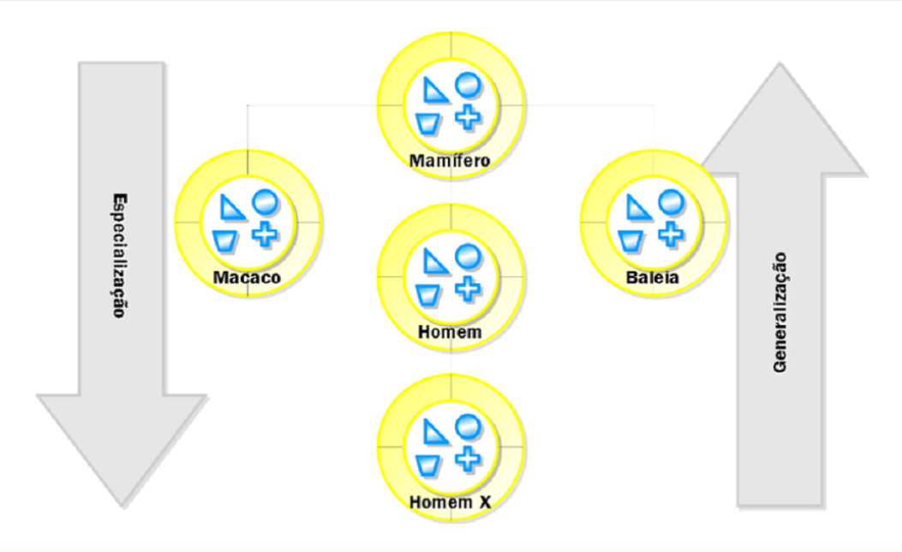
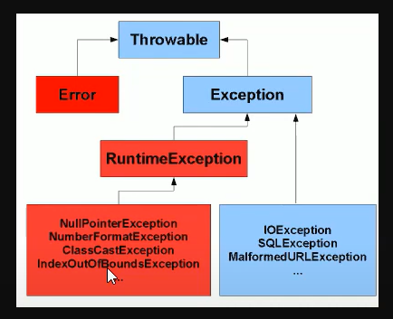

# Dev Dojo Maratona Java - William Suane - Apontamentos de aula

## Como Java Funciona

Cada JVM é especifica para cada SO.
JDK -> possui uma JVM, um compilador, ferramentas de debug. - (Desenvolver)
JRE -> apenas para executar 

arquivo fonte .java que nós vamos compilar e transformar num arquivo .class esse .class nós chamamos de byteCode que
será executado pela JVM.
A JVM vai interpretar e se preocupar em trabalhar com os SO.

## Pacotes

Pacotes eles ajudam a organizar e agrupar as classes que tem coisas em comum. 

A estrutura de pacotes nada mais é que uma estrutura de diretórios. 

- A convenção para criar pacotes começa com:

o dominio do seu site -> seguido do nome do projeto -> e o que você quer ter no seu pacote

## Comentários 

Comentários são pedaços de textos que não influenciam no código

- Comentários Multiplas linhas /**/
- inline //
- Comentários java doc /*
                       *
                        /*
Evitar incluir comentários - péssima prática
Métodos publicas são interesantes tem javadoc

## Tipos primitivos pt 01 - convenções de variáveis

Temos 8 tipos primitivos

- O que são tipos primitivos? são tipos que vão guardar em memória um valor simples
- todos escritos em letras minusculas
- padrão camelCase
- todos os tipos primitivos são numéricos com exceção do boolean, pois o char eu também posso usar numerico.
- A diferença entre eles é a quantidade de valor que você pode colocar dentro do espaço em memória
- byte por exemplo  tem 1 byte e significa 8 bits. 

## casting 

O casting é uma transformação aplicada em valores numéricos para modificar seu tipo de dado.
Casting é quando você força o java a colocar o valor de uma variavel dentro da outra.
Casting não é uma boa prática é mais indicado mudar o tipo

        int age2=(int)10000000000L;
        System.out.println(age2); //após forçar não coube então ele corta os bits, pois ele força a entrada de valores
        //1410065408

## String

String é um tipo de referencia (reference type) e não um tipo primitivo.
String é uma Classe.

## Operadores Relacionais

Operador em java é um símbolo que é usado para executar operações. Por exemplo: +, -, *, / etc.

Existem muitos tipos de operadores em Java que são fornecidos abaixo:

        Operador aritmético,
        Operador Unário,
        Operador shift,
        Operador relacional,
        Operador bit a bit (bitwise),
        Operador lógico,
        Operador ternário e
        Operador de atribuição.

## Estruturas condicionais em Java

As estruturas condicionais possibilitam ao programa tomar decisões e alterar o seu fluxo de execução. 
Isso possibilita ao desenvolvedor o poder de controlar quais são as tarefas e trechos de código executados de acordo com 
diferentes situações, como os valores de variáveis.

As estruturas condicionais geralmente analisam expressões booleanas e, caso estas expressões sejam verdadeiras, 
um trecho do código é executado. No caso contrário, outro trecho do código é executado.

- If/else
O if/else é uma estrutura de condição em que uma expressão booleana é analisada. Quando a condição que estiver 
dentro do if for verdadeira, ela é executada. Já o else é utilizado para definir o que é executado quando a condição
analisada pelo if for falsa. Caso o if seja verdadeiro e, consequentemente executado, o else não é executado.

- Switch/case
A estrutura condicional switch/case vem como alternativa em momentos em que temos que utilizar múltiplos ifs no código. 
Múltiplos if/else encadeados tendem a tornar o código muito extenso, pouco legível e com baixo índice de manutenção.
O switch/case testa o valor contido em uma variável, realizando uma comparação com cada uma das opções. Cada uma dessas 
possíveis opções é delimitada pela instrução case.

## JAVA – Estruturas de Repetição

As estruturas de repetição também são conhecidas como laços (loops) e são utilizados para executar, repetidamente, uma 
instrução ou bloco de instrução enquanto determinada condição estiver sendo satisfeita.

Qualquer que seja a estrutura de repetição, ela contém quatro elementos fundamentais: inicialização, condição, corpo e 
iteração. 

- A inicialização compõe-se de todo código que determina a condição inicial da repetição. 
- A condição é uma expressão booleana avaliada após cada leitura do corpo e determina se uma nova leitura deve ser feita ou se a estrutura de repetição 
deve ser encerrada. 
- O corpo compõe-se de todas as instruções que são executadas repetidamente. 
- A iteração é a instrução que deve ser executada depois do corpo e antes de uma nova repetição.

## While

O termo while pode ser traduzido para o português como “enquanto”. Este termo é utilizado para construir uma estrutura 
de repetição que executa, repetidamente, uma única instrução ou um bloco delas “enquanto” uma expressão booleana for verdadeira.

Veja que a inicialização precede o início da repetição. Isso significa que você deve definir o estado inicial dos elementos 
que serão utilizados nesse laço antes de seu cabeçalho. A palavra reservada while sempre será seguida de um par de parênteses, 
que delimitam a condição desta estrutura de repetição. Essa condição deve ser uma expressão booleana e, enquanto ela for 
verdadeira, esta estrutura continuará executando as instruções contidas no seu corpo.

## Do while

A estrutura de repetição do-while é uma variação da estrutura while. Existe uma diferença sutil, porém importante, entre elas. 
Em um laço while, a condição é testada antes da primeira execução das instruções que compõem seu corpo. Desse modo, se a condição 
for falsa na primeira vez em que for avaliada, as instrução desse laço não serão executadas nenhuma vez. 
Em um laço do-while, por outro lado, a condição somente é avaliada depois que suas instruções são executadas pela primeira vez, 
assim, mesmo que a condição desse laço seja falsa antes de ele iniciar, suas instruções serão executadas pelo menos uma vez.

## Estrutura For

O laço for é uma estrutura de repetição compacta. Seus elementos de inicialização, condição e iteração são reunidos na 
forma de um cabeçalho e o corpo é disposto em seguida.

Veja a sintaxe geral de uma estrutura for:

Observe que a inicialização, condição e iteração aparecem, entre parênteses, após a palavra reservada “for” e elas são 
separadas apenas por um ponto-e-vírgula. A instrução ou bloco de instruções que este tipo de laço repete são transcritos a 
partir da linha subsequente ao seu cabeçalho.

O laço for e o laço while são apenas formas diferentes de uma mesma estrutura básica de repetição. Qualquer laço for 
pode ser transcrito em termos de um laço while e vice-versa. Do mesmo modo que em um laço while, se a condição de um 
laço for já é falsa logo na primeira avaliação que se fizer dela, as instruções contidas em seu corpo jamais serão executadas.

## Arrays

Um array é uma estrutura de dados usada para armazenar dados do mesmo tipo, ou seja reprsenta uma coleção. Os arrays armazenam seus elementos em 
localizações sequenciais contínuas da memória. Em Java, arrays são objetos. Todos os métodos da classe Object podem ser 
invocados em um array.
Permanecem com o mesmo tamanho depois de criados.

– É um objeto, daí ser considerado tipo por referência.

Características Array:

- Todo array é uma variavel do tipo Reference
- Quando declarado em escopo local deve ser inicializado antes de seu uso
- Quando declarado fora de um método será inicializado como null;

## VARIÁVEL DE REFERÊNCIA EM JAVA

Todas as variáveis no Java são “de referência” (exceto se elas forem de tipos primitivos, como “int”, “float”, “short”, 
“double”, “boolean”).

Elas ou apontam para algum objeto, ou então estão vazias (valor “null”).

## Arrays Multidimensionais

Arrays Multidimensionais são estruturas de dados que possuem duas ou mais dimensões. Em suma, temos que um Array que contém 
uma única dimensão funciona internamente como um Array multidimensional. A diferença está na quantidade de índices que cada 
elemento da nossa estrutura terá como identificador.

## OBSERVAÇÕES

- Variaveis locais precisam ser inicializadas senão o código vai falhar no momento da compilação
- 

## Orientação a Objetos

Orientação a objetos é um paradigma aplicado na programação que consiste na interação entre diversas unidades chamadas de objetos.

OO foi criada para mapear o mundo real , para o mundo computacional.

Conseguimos mapear utilizando objetos, que são compostos por atributos e métodos definidos a partir de classes, 
que por sua vez são organizadas em pacotes. Esses conceitos são tão centrais em Java que não se pode programar na 
linguagem sem utilizá-los.

Classe é o que nós temos em java para representar algo do mundo real com funcionalidades em comum. 
Classe é um agrupamentos de coisas do mundo real que vão dar origem a Objetos.

model, domnio ou domain são classes que representam a lógica de negócio.

Estudante estudante; variavel de referencia chamada estudante

Estudante estudante= new Estudante(); criar objetos precisa usar a palavra new e o nome do objeto Estudante();

## Métodos (Comportamento das classes)

Composiçao de um método

- primeira parte precisamos de modificadores de acesso
- retorno: segunda parte o retorno que pode ou não retornar algo, retorno é diferente de saída, podemos no caso de não
retornar nada usar o void(vazio).
- nome do método 
- ()
- {}

public void soma(){

}

## Usando varargs no Java

O Java, possui um recurso que automatiza e esconde o processo de pôr as variáveis num array para, em seguida, 
conseguir acessá-las dentro do método: o varargs. Os argumentos ainda são postos num array para ser passados ao método, 
mas o Java se encarrega de fazer isto por nós. Utilizando varargs, podemos, então, reescrever a declaração do método 
imprimirNomes da seguinte forma:

- Com array
public static void imprimirNomes(String[] nomes) {

}

- com varArgs 
public static void imprimirNomes(String... nomes)  {
// ...
}

- varargs na verdade é uma abreviação de uma passagem de um parâmetro array.
As reticências que seguem o tipo do parâmetro indicam que este método aceita um array;
- O método pode receber quantos parâmetros forem necessários, porém só pode ter apenas um varargs na assinatura do método.
- O varargs é um facilitador, ao invés de criar um array ou lista e colocar os valores dentro dele para depois chamar o 
método, o mesmo pode ser chamado diretamente passando os n valores e os parâmetros enviados são automaticamente adicionados 
em um array do mesmo tipo do varargs.
- se você tiver mais de um atributo o varArgs deverá ser o ultimo. caso você tenha mais de um parametro
Vantagem entre o array e varArgs é que diferentes do array eu posso passar os argumentos diretamente sem 

## Coesão

Coesão é algo que está relacionado ao propósito das suas classes.
Quando se fala que uma classe é altammente coesa é que ela não está misturando o propósito delas existirem.
A coesão é o grau com o qual um módulo tem uma responsabilidade única e bem definida.

## A coplamento

O acoplamento é o grau com o qual um módulo depende de outros módulos para seu funcionamento. O ideal, para que um 
sistema seja flexível e compreensível, são módulos com alta coesão e baixo acoplamento.

Uma forma de garantir ter baixo acoplamento é utilizando o modificador de acesso private, acoplamento tem a ver cquanto uma classe
sabe da outra. 

## Modificador private / get e set

Quando utilizamos o modificador de acesso private, significa que os atributos da classe só vão poder ser acessados
pelo o objeto.

Quando você cria métodos provados você cria um método publico.

Uma das convenções do java: todas as vezes quando você está criando um método para colocar um valor dentro de um atributo 
dentro da memória você começa digitando a palavra setNomeDaVariavel.

Estou dizendo que eu vou setar, colocar dentro do meu atributo nome
Ex: public void setNome(){
}

Quando lemos um código java e lemos get/set já sabemos que é para pegar/setar.

this.nome e this.idade está retornando o espaço disponível em memória ou seja .
A variavel de referencia fora do objeto só pode acessar o que estiver publico. Tanto atributos quanto métodos

    private String nome;
    private int idade;

    public void imprime( ) {

        System.out.println(this.nome);
        System.out.println(this.idade);
    }

    public void setNome(String nome) {
        this.nome = nome;
    }

    public String getNome() {
        return nome;
    }

    

this e idempotente: Tem-se idempotência quando se chama a mesma funcionalidade com o mesmo valor e o resultado é exatamente o mesmo;

Acoplamento está relacionado ao modificadores de acesso.

## Sobrecarga de métodos

Sobrecarga de método é você ter o método com o mesmo nome, porém o tipo ou a quantidade de parâmetros são diferentes.

## Construtores

Toda vez que você está criando um objeto, você está construindo um objeto.

O construtor será executado antes de qualquer método que você tem.

Construtor não tem nenhum tipo de retorno, ele tem um modificador de acesso seguido do nome da classe.

public Anime(){}

Toda classe possui um construtor padrão, mesmo que você não escreva

Também conhecidos pelo inglês constructors, os construtores são os responsáveis por criar o objeto em memória, ou seja, 
instanciar a classe que foi definida. Eles são obrigatórios

- Nota:

Em Java apenas as Interfaces não possuem construtores.

A principal diferença entre construtores e métodos é que Construtores criam e inicializam objetos que ainda não existem, 
enquanto Métodos realizam operações em objetos que já existem. Construtores não podem ser chamados diretamente; são 
chamados de forma implícita quando a palavra chave new cria um objeto.

## Blocos Inicializadores de Instância

bloco de inicialização de instância, por que ele é executado todas as vezes que esse objeto é criado
a regra é que ele é criado antes do construtor, independente de quantos objetos nós criarmos ele sempre
será executado.

Quando você aprendeu sobre métodos, viu chaves ({}). O código entre as chaves é chamado de bloco de código. Às vezes, 
esse código é chamado de code block. Em qualquer lugar que você ver chaves é um bloco de código.

Às vezes, os blocos de código estão dentro de um método. Estes são executados quando o método é chamado. Outras vezes, 
os blocos de códigos aparecem fora de um método. Estes são chamados de inicializadores de instância. 

Quantos blocos você vê neste exemplo? Quantos inicializadores de instância você vê?

            3: public static void main(String[] args) {
            4:   { System.out.println("Feathers"); }
            5:   }
            6:   { System.out.println("Snowy"); }

Existem três blocos de código e um inicializador de instância. 

Contar blocos de código é fácil: você apenas conta o número de pares de chaves. 
Se não houver o mesmo número de chaves abertas ({) e fechadas (}), o código não compila. 
Não importa que um conjunto de chaves esteja dentro do método main () - ainda conta.

Ao contar os inicializadores de instâncias, tenha em mente que não importa se as chaves estão dentro de um método. 
Há apenas um par de chaves fora de um método. A linha 6 é um inicializador de instância.

A diferença entre um bloco de inicialização e um construtor é que um bloco de inicialização de instancia é usado para 
inicializar variáveis de instância, eles são executados antes dos construtores e são executados toda vez que o objeto da 
classe é criado já os construtores são usados para inicializar o estado do objeto. Como os métodos, um construtor também 
contém uma coleção de instruções (ou seja, instruções) que são executadas no momento da criação do objeto.

Nota:

O que aconece quando você cria um objeto até o moento?

1. Alocado espaço em memória para o objeto
2. Cada atributo de classe é criado e inicializado com valores default(null para objeto e 0 para numerais e false para boolean)
ou o que dor passado no atributo;
3. Bloco de inicialização é executado
4. Construtor é executado

## Modificador Static

O uso do modificador STATIC em um atributo de classe, por exemplo, torna esse atributo possível de ser inicializado em 
qualquer parte da classe, mas quando recebe um valor, ele é compartilhado com todos os objetos da classe. Isso significa 
que os atributos estáticos de uma classe são compartilhados por todas as instâncias dessa classe.

Modificador static faz o atributo pertencer a classe. Todos os objetos vão compartilhar do mesmo valor.
Se você tentar alterar através de uma instancia, você na verdade está alterando todo o objeto em existencia dessa classe.

O modificador Static também pode ser aplicado a métodos e inicializadores, podendo existir tantos quantos forem necessários,
ou seja, não existe uma relação de dependência entre os membros estáticos ou não estáticos da classe.

Quando o operador STATIC é aplicado a um atributo da classe, o mesmo passa a ser compartilhado com todos os objetos dessa classe, 
mas diferente de como ocorre normalmente (com os atributos não estáticos), o atributo passa a ser conhecido como “atributo de classe”, 
sendo que todos os objetos instanciados dessa classe passam a compartilhar o mesmo atributo, similarmente ao que ocorre com variáveis 
globais em linguagens de programação estruturadas.

ntre os exemplos de atributos estáticos definidos na linguagem Java estão o java.lang.Math.E (2.71828...) e o famoso 
java.lang.Math.PI (3.14159...), os quais recebem a especificação public STATIC FINAL, representando que os atributos 
têm visibilidade pública, são acessíveis sem a necessidade de existir um objeto da classe e não podem ter seus valores 
alterados. Por exemplo, a chamada java.lang.Math.PI acessa diretamente o valor do atributo estático PI.

Os atributos estáticos normalmente são utilizados na padronização de valores (constantes) dentro do projeto/sistema, 
visando compartilhamento de informações entre os objetos e para acesso direto aos atributos da classe sem a necessidade 
de existir algum objeto instanciado dessa classe.

Considerando o uso do modificador STATIC em um método de uma classe, esse método é visto como pertencente à classe e 
não pode ser usado para chamar/usar métodos ou atributos da classe que não sejam estáticos. Como os métodos estáticos não 
funcionam com uma instância (objeto) da classe, eles só podem acessar membros estáticos (atributos e métodos) da classe 
ou de outras classes que forem visíveis.

Neste contexto, os métodos estáticos são muito úteis na definição de rotinas utilitárias dentro de um sistema.
Os métodos estáticos, quando declarados públicos, podem ser acessados diretamente a partir da classe, sem a necessidade 
de declaração de objetos. Isso quer dizer que um método, para ser acessível sem a necessidade de existir um objeto da classe, 
além de ser estático, também deve ser público. Se um método for definido como estático e privado, ele será acessível 
diretamente apenas a partir da própria classe e, se for definido como estático e protegido, será acessível diretamente 
a partir da classe, suas herdeiras e outras classes do mesmo pacote.

Métodos estáticos, por pertencerem à classe não podem ser abstratos, ou seja, o uso dos especificadores STATIC e 
abstract são antagônicos.

O modificador STATIC ainda pode ser usado na declaração de blocos de inicialização, que se tratam de trechos de código que 
serão executados automaticamente quando a classe for carregada em memória. Um dos objetivos desse recurso é quando a 
inicialização de um atributo estático não pode ocorrer no momento de sua declaração, ou seja, em uma única expressão.

Por que métodos staticos não podem acessar variáveis de instancia/atributos de instancia?
porque quando você utiliza static significa que existe a possibilidade de não existir um objeto em memória.
E se não existir um objeto em memória como você vai pegar uma variavel que se pode existir em memória um atributo de instancia.
Então você não vai poder usar variaveis que não são estaticas dentro de métodos estáticos.
Mas podemos acessar um stributo estatico dentro de um método não estático.

A criação de métodos (ou atributos) estáticos é interessante quando se intenciona que eles sejam de livre 
utilização, mas bem identificados por um contexto representado pela classe.

Um exemplo na Classe calculadora que criamos , todos os métodos poderiam ser estaticos, pois eles não estão acessando
nenhum atributo da instancia.

Bloco de inicialização estatico é executado apenas uma vez quando a classe é carregada pela JVM, isso acontece antes de qualquer coisa
antes mesmo do espaço ser alocado em memória para o objeto, se tiver mais de um ele é executado em sequencia.

##  Associação  - Arrays com objetos

- Associação é criar relacionamento entre objetos, no BD relacionamento entre tabelas.

1:1-> 1 para 1 -> unidirecional
é um relacionamento um para um que define que só há uma entidade relacionada com a outra.

1:n-> 1 para n
só deve existir uma entidade da classe onde esta relação é definida, mas esta entidade está 
associada a muitas entidades da outra classe. Essa relação vai ocorrer sempre que uma classe 
tem uma coleção de tipos de outra classe.

n:1-> n para 1
é a relação inversa a 1:n, deve especificar a entidade que é a parte muitos.

n:n -> n para n
é uma associação de muitos para muitos. É usada nos casos em que uma entidade de um tipo A pode estar
associada a muitas entidades do tipo B e cada entidade do tipo B também pode estar associada a várias 
entidades do tipo A

## Herança

Herança multipla não existe no java.

quando utilizamos super(), estamos nos refererindo ao objeto mais genérico, a super classe.

quando usamos this, ele precisa ser a primeira linha dentro do construtor.

Todas as classes em java são filhas da classe Object.

- modificadores de acesso

Nota: todas os objetos que trabalhamos, são objetos por que elas se estendem, elas são um Object.
Independente de criar métodos dentro da classe, eu tenho métodos que pertencem a classe Object.

- Sobrescrita

Regras para seguir quando está sobrescrevendo:

1. o nome precisa ser exatamente o mesmo
2. A quantidade de parametro precisa ser exatamente o memso independente se você tem ou não tem.
3. O tipo de retorno tem que ser a classe ou alguma subclasse(covariancia de retorno)
4. O modificador de acesso não pode ser restritivo, ou seja public

ToString é um método da classe Object que pode ser sobrescrito em nossas classes por causa da regra da Herança.

Para ter certeza que estamos sobrescrevendo usamos : @Override

        @Override
        public String toString() {
                return "Anime{" +
                "nome='" + nome + '\'' +
                '}';
        }

## Modificador final

Comportamento quando trabalhamos com tipos primitivos:

- Utilize na declaração de atributos quando você quiser que o valor deles não seja alterado, ou seja, quando quiser criar constantes.
modificador final é uma palavra reservada;
Devem ser escritas em letras maiusculas;
Geralmente são vistos mais atributos primitivos como static final;
E quando você define um atributo final static você precisa inicializar ou através do constructor;
Podemos inicializar através do bloco de inicialização e também do atributo;
Geralmente vem acompanhadas do modificador static
devido o static são acessadas através da classe
eX:  private final static double VELOCIDADELIMITE = 250;

Comportamento quando trabalhamos com Objetos:

Ex:private final Comprador COMPRADOR = new Comprador();

No exemplo acima estamos dizendo que a referencia que a variavel COMPRADOR tem para esse objeto new Comprador(),
nunca poderá ser alterada, porém os dados podem ser alterados,a referencia é imutável, 
uma vez que você associa um objeto a ela nunca mais poderá ser alterado.

Modificador final o comprtamento dele quando utilizamos para classes e métodos.

O modificador final quando aplicado para classes e métodos está lidando diretamente com herança.

- Utilize na declaração de métodos quando quiser impedir que um método seja sobrescrito por uma subclasse.

'imprime()' cannot override 'imprime()'

 - Utilize na declaração de classe quando quiser impedir que a classe seja estendida.

-> Cannot inherit from final

    public final class Carro {

    private String nome;
    public final static double VELOCIDADELIMITE = 250;
    public final Comprador COMPRADOR = new Comprador();

    public String getNome() {
        return nome;
    }

    public void setNome(String nome) {
        this.nome = nome;
    }
    } 
 

Exemplo de Classe static: String.

## Singleton pattern

o padrão singleton é um padrão de projeto de software que restringe a instanciação de uma classe a uma instância singular. 
Um dos bem conhecidos padrões de projeto "Gang of Four" , que descrevem como resolver problemas recorrentes em software 
orientado a objetos , o padrão é útil quando exatamente um objeto é necessário para coordenar ações em um sistema.

Mais especificamente, o padrão singleton permite que os objetos:  

Certifique-se de que eles tenham apenas uma instância
Forneça acesso fácil a essa instância
Controlar sua instanciação (por exemplo, ocultando os construtores de uma classe )

Os singletons geralmente são preferidos às variáveis Globais porque não poluem o namespace global (ou o namespace que o 
contém). Além disso, eles permitem alocação e inicialização lentas, enquanto variáveis globais em muitas linguagens 
sempre consumirão recursos.
As implementações do padrão singleton garantem que apenas uma instância da classe singleton exista e normalmente fornecem 
acesso global a essa instância.

No java uma das formas de se atingir isso é através do modificador final. 

## Enumeração

Enum é uma especialização da linguagem para representar um número fixo de valores previamente conhecidos. 
Por exemplo, os nomes dos dias de uma semana, os nomes dos meses que compõem um ano, os nomes dos presidentes da república, etc.

Tornam o código mais explícito, mais legível, e menos vulnerável a erros de programação.

Enumerações em Java podem ser declaradas dentro ou fora de uma classe. A única restrição à sua declaração é que ela não 
pode ser declarada dentro de um método, pois um método geralmente não possui um escopo tão grande de classe.

- Vários métodos da classe JAVA Enum
Para poder usar os métodos mencionados abaixo, será necessário importar o pacote java.lang.Enum.

1. valores () – Este método retorna o valor de todas as constantes que encapsulam o JAVA Enum.
2. ordinal() – O método ordinal() retorna o número de índice de cada enum como se os enums fossem 
3. estruturas de dados como arrays. É usado para estabelecer uma hierarquia de tipos.
4. valueOf () – Se existir, esse método retornará a constante de enumeração de um valor de string.

- Diferença entre uma classe e JAVA Enum

Embora o Java Enum, assim como uma classe possa ter métodos e variáveis, os membros enum devem ser públicos, 
estáticos e finais. Nas classes, os usuários têm a liberdade de manter o escopo dos membros flexível.

De forma geral um enum é um tipo especial de classe onde você vai definir atributos que representam a enumeração no nosso
exemplo PESSOA_FISICA, PESSOA_JURÍDICA, esses atributos não podem ser alterados, para se criar uma enumeração você usa
public enum ao invés de public class no caso da classe, e podemos trabalhar com construtores e atributos. Enumração
pode ficar dentro da própria classe, 

## Classes Abstratas

Em Java, temos um tipo especial de classe chamado classe abstrata. Este tipo de classe possui uma característica muito 
específica, que é o de não permitir que novos objetos sejam instanciados a partir desta classe. Por este motivo, as 
classes abstratas possuem o único propósito de servirem como super classes a outras classes do Java.

Classe abstratas foram criadas para resolver um problema de designer, de desenho de código. 

Ex: Funcionario seria um template, é abstrato e cargo seria a implementação de funcionario.
 
A classe abstrata não pode ser instanciada.
O método abstrato não pode ter corpo;
todos os métodos abstrataos precisam ser implementados, é um contrato.
Nunca posso ter um método abstract numa classe não abstrata dá erro. 
Classes abstratas podem ter métodos concretos e abstratos.

Não podemos ter multipla herança de classe com java, porém você pode ter uma hierarquia maior. se eu criar uma classe por exemplo pessoa que tenha
um método abstrato e Funcionario extender pessoas, se eu implementar o método abstrato em Funcionário, eu não preciso
implementar nos outros métodos devido a herança, todos os outros terão acesso.

## Interfaces 

A interface é um recurso muito utilizado em Java, bem como na maioria das linguagens orientadas a objeto, para “obrigar” 
a um determinado grupo de classes a ter métodos ou propriedades em comum para existir em um determinado contexto, contudo 
os métodos podem ser implementados em cada classe de uma maneira diferente. Pode-se dizer, a grosso modo, que uma 
interface é um contrato que quando assumido por uma classe deve ser implementado.

Dentro das interfaces existem somente assinaturas de métodos e propriedades, cabendo à classe que a utilizará realizar a
implementação das assinaturas, dando comportamentos práticos aos métodos.

Ao contrário da herança que limita uma classe a herdar somente uma classe pai por vez, é possível que uma classe implemente 
varias interfaces ao mesmo tempo.

Por fim, interface nada mais que uma espécie de contrato de regras que uma classes deve seguir em um determinado contexto. 
Como em Java não existe herança múltipla, a interface passa a ser uma alternativa.

Interfaces em java são todas abstratas e publicas.

sintaxe:
public interface Nome{
}

Não existe limite para implementar interfaces.

No java 8 foi disponibilizado a interface que ela tenha métodos com implementação. 
A inserção do default é o que diz que um método tem implementação, ou seja métodos concretos com funcionalidades.

Ex:
default void checkPermission(){
System.out.println("Fazendo checagens de permissão.");
}

Não podemos criar objetos de interface.  

O modificadorers de acesso private -> default->protected-> public, 
Se você criar um método publico qualquer um dos pacotes private -> default->protected-> será mais restritivo, a sobrescrita
te força a ter um método publico, se por acaso em uma classe abstrata você colocar ou protected ou default por exemplo
você pode sobrescrever com protected ou public nunca private.

Podemos declarar atributos em uma interface. E por padrão todos os atributos são constantes.

Ex:     public static final int MAX_DATA_SIZE=10;

E a partir do java 8 foi possivel adicionar métodos estáticos, métodos estáticos nunca serão sobrescritos por que eles 
pertencem a classe.

## Polimorfismo

Em relação ao polimorfismo, o principal conceito é a propriedade de duas ou mais classes derivadas de uma mesma superclasse 
responderem a mesma mensagem, cada uma de uma forma diferente. Ocorre quando uma subclasse redefine um método existente na 
superclasse, ou seja, quando temos os métodos sobrescritos (overriding)

Recapitulando: o principal conceito do polimorfismo é a propriedade de duas ou mais classes derivadas (Macaco, Homem e Baleia) 
de uma mesma superclasse (Mamifero) responderem a mesma mensagem (locomoverSe()), cada uma de uma forma diferente (pulando de 
galho em galho, andando e nadando, respectivamente).

## Cast e instanceof

O operador instanceof em Java é usado para verificar se um objeto pertence a um determinado tipo ou não em tempo de execução. 
Também é uma palavra-chave integrada na linguagem de programação Java e é usada principalmente para evitar ClassCastException em Java . 
É usado como uma verificação de segurança antes de lançar qualquer objeto em um determinado tipo. Este operador tem uma
forma de object instanceof Type e devolve true se o objecto satisfizer a relação IS-A com o Type ie o objecto é uma 
instância da classe Type ou objectéa instância de uma classe que estende Type ou object é uma instância de uma classe 
que implementa a interface Type.

Uma vez que um objeto passou na verificação instanceof, é seguro fazer a conversão de tipo nesse tipo, sem se preocupar 
com java.lang.ClassCastException .

ClassCastException é uma exceção de tempo de execução gerada em Java quando tentamos converter incorretamente uma classe 
de um tipo para outro . Ele é lançado para indicar que o código tentou converter um objeto em uma classe relacionada, mas 
da qual não é uma instância.

## Exceção

Exceções são condições anormais de seu programa, 
Exceções (do inglês Exception, acrônimo de Exceptional events) são objetos que sinalizam que ocorreu algum problema no 
tempo de execução de um programa.

No caso de uma exceção acontecer e não ser tratada, o programa irá terminar com uma mensagem de erro. O tratamento 
de exceções (exception handling) permite ao programador capturar exceções e tratá-las sem interromper o fluxo normal de 
execução do programa.

Throwable é a mãe de todas as exceções em java. Throwable significa lançável.
Error são situações que não tem como você se recuperar, geralmente é impossivel de se recuperar em tempo de execução.

Nós temos exceções Checked e unchecked. 

- Exceções checadas(Checked ): são exceções que são filhas de exception diretamente, e se essas exceções não forem tratadas 
elas vão lançar um erro em tempo de compilação, você não consegue compilar seu código.

Se você estiver trabalhando com arquivo e fizer alguma coisa relacionada a arquivo ele lança o IOException(possiveis exceções de
entrada e saída)

As exceções Checked precisam é obrigado tratar, se vc não fizer o tratamento ela não compila.

- Exceções não checadas(unchecked): são exceções que são runtime ou filhas de RuntimeException , são exceções que quando 
lançada pelo o programa quase 100% das vezes o programa é o seu código, ou que você não fez uma tratativa coreta.
Ex: se você quiser formatar um numero e o numero é um caracter literal uma letra você vai ter um NumberFormatException,
Se você faz um cast de um objeto que não pode você recebe um ClassCastException.
Se você tentar acessar um objeto que não existe vai dar um NullPointerException.
Se você tentar acessar uma lista que não existe vai dar um IndexOutOfBoundsException.
Essas exceções quando são lançadas geralmente seu código deve ser melhorado

As exceções Unchecked não é necessário fazer o tratamento, e nós podemos criar as nossas pr´oprioas exceções unchecked.

As exceções RunTimeException são exceções que o desenvovedor deveria ter tratado

RECAPITULANDO:

Runtime Exception é uma exceção;
Error não é uma exceção, por que não é filha de Exception;
Error é um Throwable e Exception também é um Throwable.
Runtime também é um throwable.
Runtime é uma exceção unchecked e você não necessariamente precisa fazer validação para o seu código compilar.

Quando estiver trabalhando com exceção unchecked é importante usar as exceções específicas, para que quando alguém
estiver utilizando o meu código ele saberá o que está acontecendo.

Sempre que estiver fazendo diversos tipos de método, por exemplo para idade, e não quiser colocar uma idade negativa ou
acima de 150 anos , esse tipo de coisa tratamos com exceções, sempre que quiser fazer uma validação, lançamos uma exceção.

O throws é usado para disparar uma exception, enquanto o try/catch é usado para tratar uma exception. 
Quando colocamos o throw na assinatura estamos falando que sabemos que nosso código pode gerar uma exception mas naquele 
momento não estamos interessados em tratar ela e quem for usar o nosso método será responsável de fazer o tratamento.

Para Exceções, são 3 opções:

1 - try/catch: uso quando não quero que a exceção se perpetue pelo código, pois não vou usar aquele "problema" em nenhum 
outro lugar.

2 - throws: quando quero passar a possível exceção do método que estou para outras classes, quando o tratamento não é 
necessário naquela classe pois vou precisar da exceção em outra classe.

3 - throw: quando eu quero lançar uma exceção/quando quero que aquele método especifico de um erro(exceção)

Resumidamente as exceções Checked são aquelas no qual você é obrigado a tratá-la, seja com um bloco try-catch ou mesmo 
com um throws (relançando a mesma para outro local). Por outro lado, quando você tem exceções do tipo Unchecked não é 
obrigatório o tratamento da mesma, você pode tratar apenas se quiser, se sentir que é necessário para o bom funcionamento 
da sua aplicação. Checked exceptions são utilizadas para erros recuperáveis enquanto que Unchecked exceptions são 
utilizadas para erros irrecuperáveis. Significa dizer que quando você sabe que seu erro pode ser tratado, 
você utiliza Checked Exceptions, caso contrário utilize Unchecked Exceptions.

A princípio, todas as classes filhas de Exception são do tipo checked, exceto pelas subclasses de
java.lang.RuntimeException (exceção em tempo de execução).

Quando  utilizar try/catch ou throws

Notas:

Exceções mais genéricas dentro de um catch tem que vir sempre no final. Exemplo RuntimeException ela é muito genérica

IOException é a exceção mais genérica da linha de FileNotFoundException

- MultiCatch em linha, eu posso incluir multiplos catchs , ou seja posso incluir exceções que não estão na mesma linha de herança
dentro de um mesmo catch separado via |(pipe). Isso só pode ser feito com classes com linhas de herança diferente.
Ex: 

         try {
              talvezLanceException();
         } catch (SQLException | IOException e) {
               throw new RuntimeException(e);
          }

## Try with Resources

O que é: um recurso sintático do Java para uso seguro de recursos de forma segura.

Objetivo: garantir que recursos escassos - como conexões com o banco de dados, referências a arquivos, conexões de rede  
sejam devidamente fechadas após o uso, mesmo num cenário excepcional.

Funcionamento: os recursos declarados no try (entre os parêntesis) devem implementar a interface AutoCloseable e terão seu 
método close() automaticamente chamado ao final do bloco try.

Uso simples:

        try (BufferedReader br = new BufferedReader(new FileReader(path))) {
        return br.readLine();
        }

Benefícios:

Substitui o tratamento manual de exceções:
Menos propenso a erros de codificação, quando o programador não sabe ou esquece de executar todo o tratamento necessário.
Evita vazamento de recursos, quando o programador esquece de fechá-lo ou não trata corretamente uma situação excepcional.
Menos código boilerplate:
Facilita e agiliza a codificação.
Menos chance de esquecer algo.
Menos código significa menos bugs e menos coisas para dar manutenção.

O try com recursos se resposnbiliza de fechar a conexão da variavel de referencia.

A regra é você só pode colocar objetos /variaveis de referencia dentro do Try with resources que implementem a 
interface Closeble ou Readable

        try (Reader reader= new BufferedReader(new FileReader("teste.txt"))){

        }catch (IOException e){

        }

## Criar as póprias Exceções

Quando estamos trabalhando em um software, criar suas próprias exceptions pode ser muito vantajoso. Primeiro, porque não 
há uma confusão sobre o que são exceções da linguagem Java, ou de alguma biblioteca terceira, com exceções do sistema.

Outro ponto interessante, é que poderíamos adicionar construtores que armazenam determinada informação que será útil 
para gerar logs ou mensagens de erro ao usuário.

Por fim, podemos gerar exceptions que tornem mais claros determinados tipos de erro, como por exemplo, objetos não 
preenchidos corretamente, objetos nulos, validações incorretas.

Ex de uma instrução customizada:

        public class LoginException extends Exception {
        
        
        }

Exceções customizadas são exceções que você pode criar e definir o tratamento delas baseados na lógica de negócio.

- Exceções e regras de sobrescritas
quando você está sobrescrevendo um método você não é brigado a declarar as mesmas exceções que aquele método 
está declarando, por que a funcionalidade da sobrescrita pode ser diferente e não lance exceção. Mas eu posso colocar uma nova exceção
e trtá-la.
- Você não pode declarar nenhuma exceção do tipo cheched que não foi declarada no método original.

## Referencias

- https://www.devmedia.com.br/construtores-em-java-primeiros-passos/28618
- https://sites.google.com/view/javacommiza/home/capitulo-01/criando-objetos/blocos-inicializadores-de-instancia
- https://www.devmedia.com.br/modificadores-de-acesso-do-java/27065
- https://en.wikipedia.org/wiki/Singleton_pattern
- https://www.devmedia.com.br/entendendo-interfaces-em-java/25502
- https://blog.grancursosonline.com.br/poo-principal-conceito-de-polimorfismo/#:~:text=Em%20rela%C3%A7%C3%A3o%20ao%20polimorfismo%2C%20o,os%20m%C3%A9todos%20sobrescritos%20(overriding).
- https://javarevisited.blogspot.com/2015/12/10-points-about-instanceof-operator-in-java-example.html#axzz7kcFpEWq1